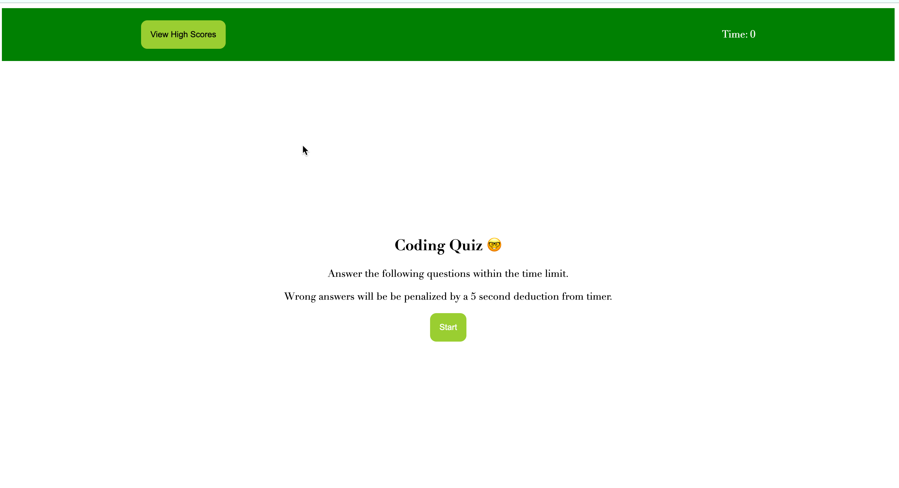
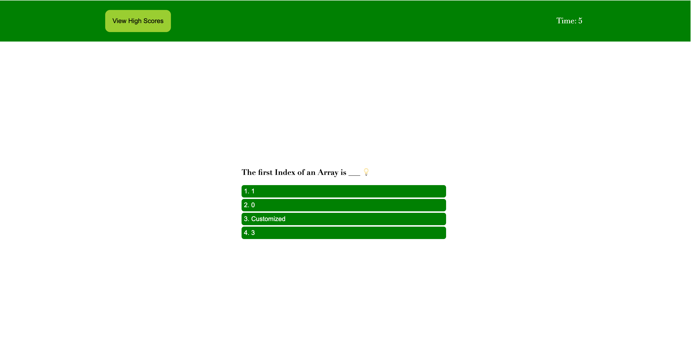
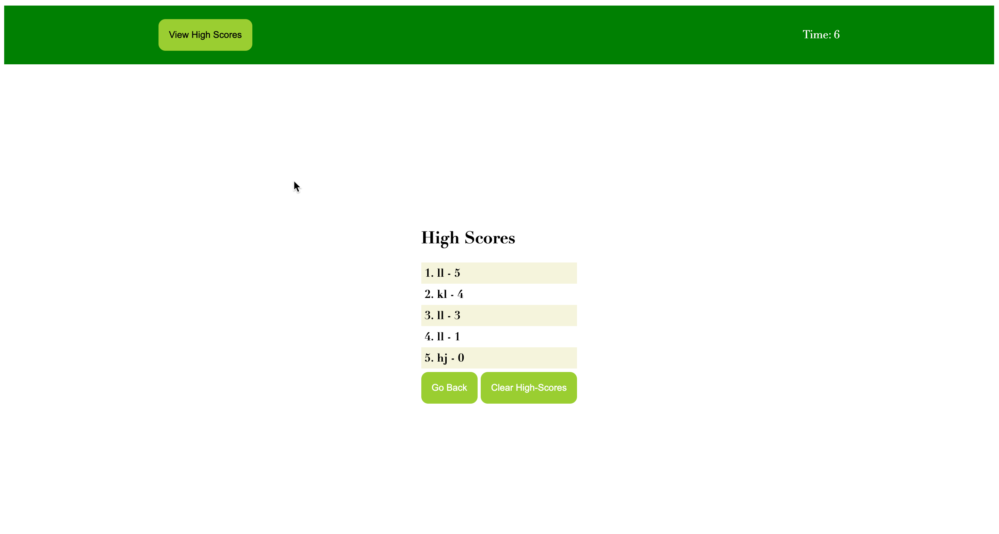

# Code-Quiz

## Description

As a coding boot camp student, I have created a timed quiz using JavaScript. 

The Quiz will be able to:

    -- Store High Scores
    -- The 60 seconds timer will begin when the start quiz button is clicked
    -- User will know if they got question right or wrong
    -- If user guesses incorrectly, time will be deducted from timer (10 secs)
    -- User will be able to enter initials and view high scores

## Table of Contents 

- [Mock-Up](#mock-up)
- [Credits](#credits)

## Mock-Up

Below is a mock-up 

## Credits ©

-Google

-YouTube

## License

## Author

[@LatoyaLyew] (https://github.com/lflyew) ❤️

🏆 